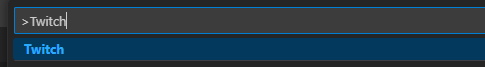
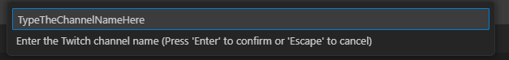

# Twitch Chat VSCode Extension

This is a Visual Studio Code extension that allows you to view Twitch chat directly within VSCode.

## Usage

1. Press Ctrl+Shift+P (Windows/Linux) or Cmd+Shift+P (macOS) to open the command palette.
2. Type Twitch and select the Twitch command.

3. Enter the name of the Twitch channel you want to connect to. (case insensitive)

4. Enjoy

## Features

- Connect to any Twitch channel and view the chat.
- Messages are displayed in real-time.
- Usernames are highlighted for better readability.
- Compatible with all themes in VSCode.
- Open multiple chat windows simultaneously.

